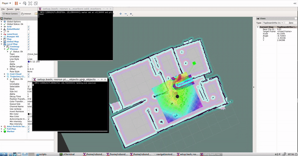

# Home Service Robot 
This robotic program simulates a robot and its environment, and contains code to execute following functions:
* Map the virtual environment using Grid Based FastSLAM
* Localize the robot in the virtual environment using AMCL
* Navigate to goal location using Djikstra's algorithm

# Dependencies
## gmapping
This ros package implements OpenSlam's Gmapping which provides laser-based SLAM. Using slam_gmapping, you can create a 2-D occupancy grid map (like a building floorplan) from laser and pose data collected by a mobile robot. gampping is based on Grid based FastSLAM algorithm. [Read more here](http://wiki.ros.org/gmapping)

## map_server
map_server provides the map_server ROS Node, which offers map data as a ROS Service. It also provides the map_saver command-line utility, which allows dynamically generated maps to be saved to file. [Read more here](http://wiki.ros.org/map_server)

## move_base
The move_base package provides an implementation of an action (see the actionlib package) that, given a goal in the world, will attempt to reach it with a mobile base. The move_base node links together a global and local planner to accomplish its global navigation task. It supports any global planner adhering to the nav_core::BaseGlobalPlanner interface specified in the nav_core package and any local planner adhering to the nav_core::BaseLocalPlanner interface specified in the nav_core package. The move_base node also maintains two costmaps, one for the global planner, and one for a local planner (see the costmap_2d package) that are used to accomplish navigation tasks. [Read more here](http://wiki.ros.org/move_base)

## amcl
amcl is a probabilistic localization system for a robot moving in 2D. It implements the adaptive (or KLD-sampling) Monte Carlo localization approach (as described by Dieter Fox), which uses a particle filter to track the pose of a robot against a known map. [Read more here](http://wiki.ros.org/amcl)

# Installation
1. Download or clone the repository
2. Navigate to catkin_ws directory
3. Install dependencies using ```rosdep install``` command
4. Build the program using ```catking_make``` command

# Run
## SLAM 
1. Navigate to scripts directory (catkin_ws/src/scripts)
2. Execute the test_slam.sh script
3. This will launch Gazebo, RViz and Teleop nodes
4. You can use the teleop to maneuver the robot inside Gazebo and visualize the mapping process in RViz
## Navigation
1. Navigate to scripts directory (catkin_ws/src/scripts)
2. Execute the test_navigation.sh script
3. This will launch Gazebo, map_server, move_base and RViz nodes. 
4. Now, you can use ```2D Nav Goal``` function from RViz to send goal location to the robot and the robot moves to the goal location
## Home Service
Home service script simulates an action of a robot picking up an object from one location and dropping it at another location
1. Navigate to scripts directory (catkin_ws/src/scripts)
2. Execute the home_service.sh script
3. This will launch Gazebo, map_server, move_base, pick_objects, draw_markers and RViz nodes.
4. Inside RViz, a cube appears at the pickup location and the robot navigates to the pickup location. Once reached, the cube disappears indicating the robot has picked up the object. The robot then moves to the drop-off location. Once reached, the cube appears at the drop-off location indicating the object has been dropped off. 
